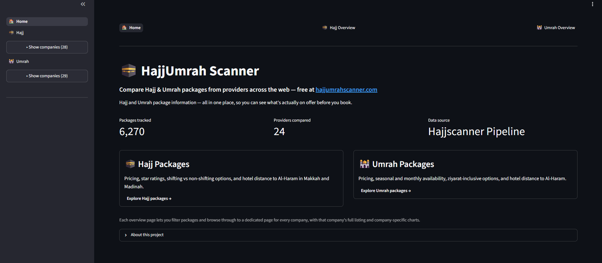
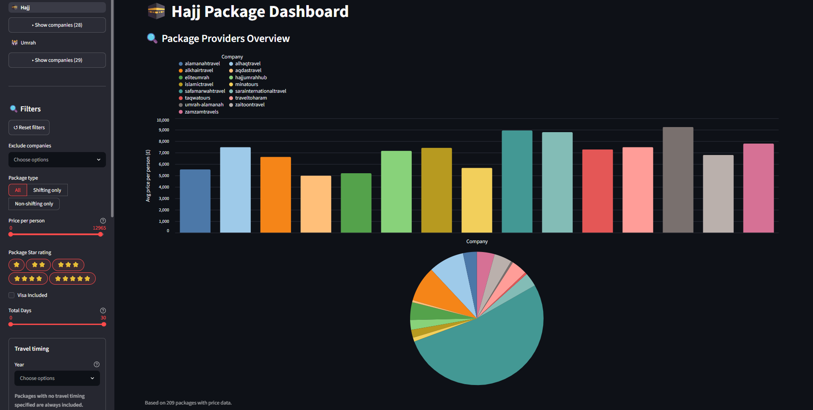
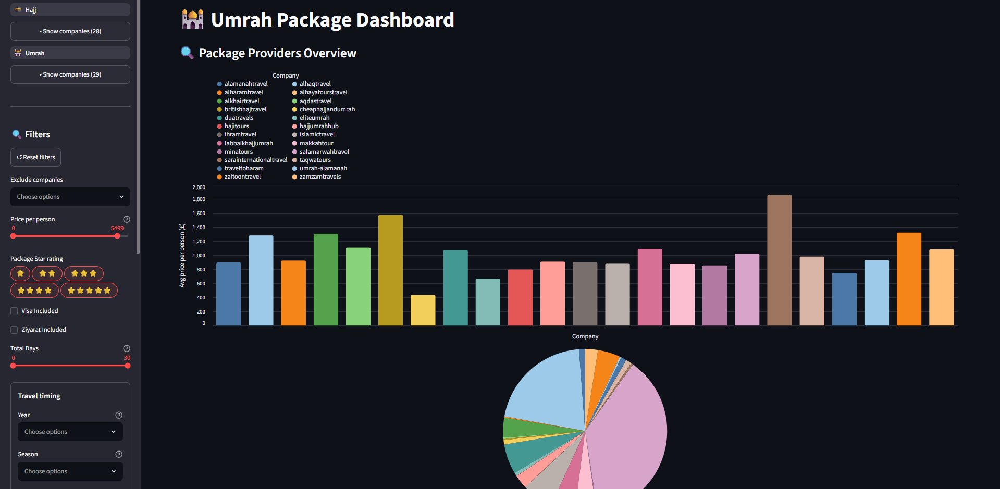

# 🕋 Hajj Scanner Dashboard

An interactive data dashboard for exploring and comparing Hajj and Umrah packages. Built with [Streamlit](https://streamlit.io/) and [Altair](https://altair-viz.github.io/).

> **Part of the [HajjScanner](https://github.com/samirm-git/hajjscanner) project** — this repo contains the dashboard front-end only. Head to the main repo for the full project

---

## 🌐 Live App
 
👉 **[hajjumrahscanner.com](https://hajjumrahscanner.com)**
 
---

## 📸 Screenshots



 



---

## 🎬 Demo


[](https://drive.google.com/file/d/1iim1DXv-EmqWc8kNtY1h2UVG5JPbPnYb/view?usp=sharing)
---

## ✨ Features

- **Price per person** bar chart across all packages, grouped by company
- **Provider breakdown** pie chart with linked average price comparison
- **Interactive selection** — click any chart element to filter across all views
- **Package detail panel** — click a bar to expand full package information
- **Distance vs. price scatter plot** for spotting value-for-money packages
- **Filters** to narrow down by price range, star rating, shifting status, and more

---


## 🚀 Getting Started

### Prerequisites

- Python 3.9+
- Access to the S3 bucket used by [HajjScanner](https://github.com/your-username/hajjscanner) (or a local data file — see [Contributing](#contributing))

### Installation

```bash
git clone https://github.com/your-username/hajjscanner-dashboard.git
cd hajjscanner-dashboard
pip install -r requirements.txt
```

### Running the app

```bash
streamlit run app.py
```

---

## 🤝 Contributing

Contributions are welcome! Here's how to get involved:

1. **Fork** this repository and clone your fork locally.
2. **Create a branch** for your feature or fix:
   ```bash
   git checkout -b feature/your-feature-name
   ```
3. **Make your changes.** If you're working on a new chart or filter, add it as a new file following the existing naming convention (`create*.py`).
4. **Test locally** with `streamlit run app.py` before submitting.
5. **Open a pull request** with a clear description of what you've changed and why.

### Ideas for contribution

- New chart types (e.g. price trends over time, hotel ratings breakdown)
- Improved mobile layout
- Additional filter options
- Unit tests for data loading and filter logic

If you'd like to contribute but don't have S3 access, you can point `dataLoader.py` at a local CSV file for development. Raise an issue and we can help get you set up.

---

## 🔗 Related

- [HajjScanner](https://github.com/samirm-git/hajjscanner) — the main repo containing the web scraper and data pipeline that feeds this dashboard

---

## 📄 License

This project is open source. See [LICENSE](LICENSE) for details.
